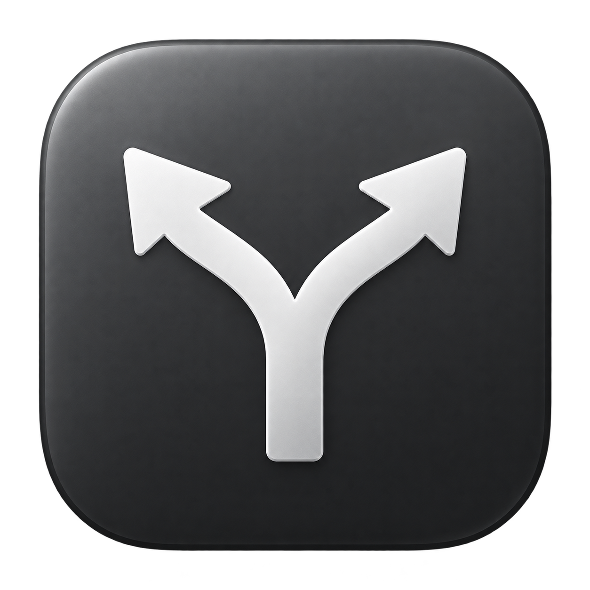

# Chooser



Open links in **Brave or Chrome** with a small macOS menu bar app. Choose a browser at your cursor or route links automatically. Local only — no extensions, accounts, or cloud.

**[Download DMG or ZIP](https://github.com/tommyin-it/chooser/releases/latest)** · macOS 13+ · Apple Silicon & Intel

<a id="install--no-developer-tools-needed"></a>

## Install

1. Download the DMG, open it, and drag **Chooser.app** to **Applications**.
2. Eject the DMG and open Chooser from Applications.
3. Click its menu bar icon → **Settings → Get started → Connect…** to enable link handling.

<a id="first-launch-and-signing"></a>

The app is **not Apple-notarized**. If macOS blocks first launch, follow [Apple’s instructions](https://support.apple.com/en-am/guide/mac-help/open-a-mac-app-from-an-unknown-developer-mh40616/mac) to use **Privacy & Security → Open Anyway**, if available.

## Features

- Three modes: **Choose**, **Brave**, and **Chrome**.
- Saved browser profiles, optional extra profiles, and four picker layouts.
- Per-app rules, such as **Slack → Chrome**.
- Custom global shortcut with Hyper support; **⌘1–⌘9** in the picker.
- Optional launch at login and persistent settings.
- **English / Polish**, selectable in **Settings → Get started → Language**.

Links clicked inside a browser stay there. Chooser handles links passed to macOS by other apps.

## Build

Requires Apple Command Line Tools with Swift 5.9+.

```sh
git clone https://github.com/tommyin-it/chooser.git
cd chooser
./scripts/build.sh
open build/Chooser.app
```

Tests: `./scripts/test.sh` · Benchmark: `./scripts/benchmark.sh` · Universal DMG/ZIP: `./scripts/release.sh`
